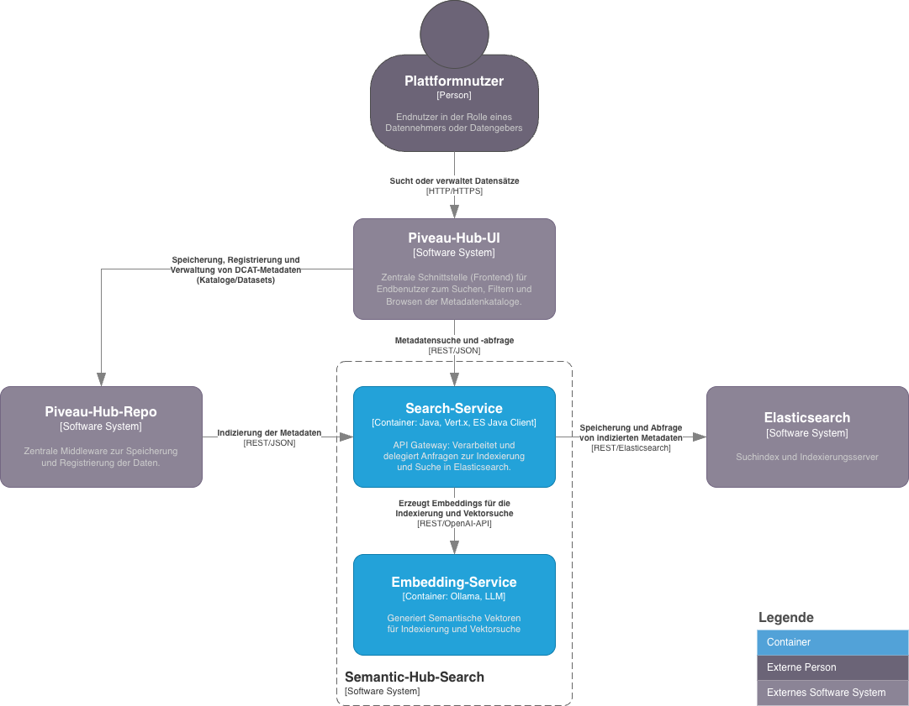

# Semantic-Hub-Search (Fork)

Im Förderprojekt [KI-Allianz Baden-Württemberg, Teilvorhaben Datenplattform](https://ki-allianz.de/unsere-projekte/ki-datenplattform/) erforscht und entwickelt das [FZI Forschungszentrum Informatik](https://www.fzi.de/) eine semantische Suchfunktion für die Datenplattform [Piveau](https://www.piveau.de/). Eine erste Version des Quelltextes soll im Januar 2026 veröffentlicht werden.


## Übersicht

Dieser Fork basiert auf der [Piveau-Hub-Search](https://gitlab.com/piveau/hub/piveau-hub-search/-/tree/5.1.8) Komponente (v5.1.8) von [Fraunhofer FOKUS](https://www.fokus.fraunhofer.de). Die Komponente kapselt Indizierungs- und Suchanfragen für [Elasticsearch](https://www.elastic.co) (von Elasticsearch B.V.) innerhalb der Open-Source Datenmanagementplattform [Piveau](https://www.piveau.de/) als REST-Service. 

Dieser Fork erweitert die Piveau-Hub-Search Komponente um eine **semantische Suchfunktion**, zusätzlich zur bestehenden lexikalischen Suche. Hierfür werden Word-Embeddings und die Vektorsuchfunktionen aus der kostenfreien Elasticsearch-Version genutzt. Vorteile der semantischen Suche sind die Erkennung inhaltlicher Verwandtschaft (thematisch ähnliche Begriffe liegen nah beieinander im Vektorraum), eine verbesserte Treffergenauigkeit (z.B. findet die Suche nach „Bahn“ auch „Schienenverkehr“) und die Möglichkeit zur sprachübergreifenden Suche. Die Auffindbarkeit inhaltlich relevanter Datensätze wird dadurch signifikant verbessert.

## Inhalt dieses Repositorys

Derzeit enthält das Repository folgende Dateien:

```text
├─ docs/                            Dokumentationsrelevante Inhalte.
│  └─ c4-container-diagram.png      C4 Containerdiagramm (Architektur).
├─ LICENSE.md                       Die Apache 2.0 Lizenz.
└─ README.md                        Diese Dokumentation.
```

## Architektur und technische Umsetzung

Die als Service implementierte **Semantic-Hub-Search**-Komponente vermittelt zwischen dem Repository (Piveau-Hub-Repo) und der Suchmaschine (Elasticsearch) für die Indizierung von Daten sowie zwischen dem Frontend (Piveau-Hub-UI) und Elasticsearch für die eigentliche Suche. Die Komponente ermöglicht die Volltextsuche von indizierten Ressourcen (Datasets, Kataloge und Vokabulare), die dem Standard [DCAT-AP](https://interoperable-europe.ec.europa.eu/collection/semic-support-centre/dcat-ap) entsprechen. Ressourcen werden in Elasticsearch indiziert und durch eine RESTful Schnittstelle via des Elasticsearch [Java-API-Client](https://www.elastic.co/guide/en/elasticsearch/client/java-api-client/8.17/index.html) abgefragt.



Elasticsearch bietet seit Version 8 viele nützliche KI-Funktionen für die semantische Suche (wie Ingestion Pipelines, Inference Processors oder das ELSER-Modell), diese sind jedoch in vollem Umfang nur in den kostenpflichtigen [Platinum- und Enterprise-Versionen](https://www.elastic.co/subscriptions) verfügbar. Um dennoch eine semantische Suche auf Basis von Word-Embeddings und vektorbasierten Ähnlichkeitsmaßen umzusetzen, integriert die Semantic-Hub-Search Erweiterung einen eigenen Embedding-Service, der auf [Ollama](https://ollama.com) basiert. Dieser Service generiert beim Indizieren und bei Suchanfragen die Word-Embeddings-Vektoren für übermittelte Textfragmente. Das verwendete Modell ist dabei frei konfigurierbar. Wichtig ist, dass die API-Schnittstelle der Suchkomponente für externe Komponenten wie Piveau-Hub-Repo und Piveau-Hub-UI durch diese Erweiterung unverändert bleibt, was den Austausch zwischen den Komponenten vereinfacht.

Beim Indizieren neuer DCAT-Metadaten werden für wesentliche Attribute wie Titel, Beschreibung und Schlagworte die zugehörigen Embeddings berechnet. Diese werden anschließend als Teil der DCAT-Metadaten (JSON) in Elasticsearch gespeichert. Eine Suchanfrage beginnt mit der Berechnung des Embeddings für den Suchbegriff. Daraufhin erfolgt eine kNN-Suche (via Approximate Nearest Neighbour) auf den vektorisierten Attributen in Elasticsearch. Die Suchergebnisse dieser Vektorsuche werden dann in einem nachgeschalteten "Rescore-Query" mit einer klassischen lexikalischen Volltextsuche kombiniert, um eine hybride Suche zu realisieren.

## Lizenz

Dieses Projekt steht unter der [Apache 2.0 Lizenz](https://www.apache.org/licenses/LICENSE-2.0). Die vollständigen Lizenzbestimmungen finden Sie in der beiliegenden Datei [LICENSE.md](LICENSE.md).

## Danksagung

Diese Erweiterung wurde im FuE-Vorhaben [KI-Allianz Baden-Württemberg, Teilvorhaben Datenplattform](https://ki-allianz.de/unsere-projekte/ki-datenplattform/) gefördert durch das [Ministerium für Wirtschaft, Arbeit und Tourismus](https://wm.baden-wuerttemberg.de) des Landes Baden-Württemberg entwickelt. Die Erkenntnisse und Ergebnisse zahlen auf die Aktivitäten der [Genossenschaft KI-Allianz Baden-Württemberg eG](https://ki-allianz.de/) ein. 

Die Grundlage für die Erweiterung bildeten die im Rahmen der [Piveau-Datenmanagementplattform](https://www.piveau.de/) vom [Fraunhofer FOKUS](https://www.fokus.fraunhofer.de) geleisteten Arbeiten am Originalprojekt. Wir danken allen direkt und indirekt Beteiligten für die wertvolle Unterstützung und ihren Beitrag zu diesem Projekt.

