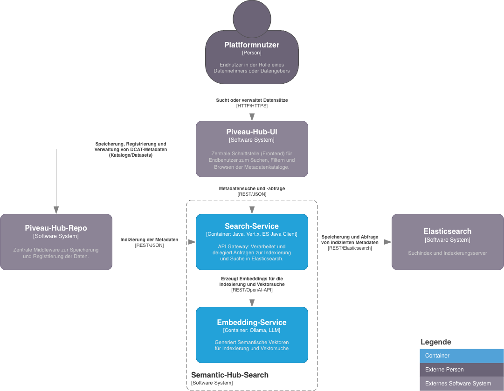

# Semantic-Hub-Search (Patch)

Im Förderprojekt [KI-Allianz Baden-Württemberg, Teilvorhaben Datenplattform](https://ki-allianz.de/unsere-projekte/ki-datenplattform/) erforscht und entwickelt das [FZI Forschungszentrum Informatik](https://www.fzi.de/) eine semantische Suchfunktion für die Datenplattform [Piveau](https://www.piveau.de/).

Dieses Repository enthält einen Patch für `piveau-hub-search` in Version `5.3.0`. Der Patch erweitert die bestehende Suchkomponente um eine semantische bzw. hybride Suche auf Basis von Text-Embeddings und Elasticsearch-Vektorsuche. Das Repository stellt außerdem einen automatisierten Patch- und Build-Prozess über ein `Makefile` bereit.

## Zielgruppe

Dieses Repository richtet sich an Entwickler*innen und Betreiber*innen von Piveau-Instanzen, die die Suchkomponente `piveau-hub-search` um semantische Suchfunktionen erweitern möchten, ohne dauerhaft einen eigenen Fork des Originalprojekts pflegen zu müssen.

## Übersicht

Dieses Repository stellt einen Patch bereit, der die [Piveau-Hub-Search](https://gitlab.com/piveau/hub/piveau-hub-search/-/tree/5.3.0) Komponente (v5.3.0) von [Fraunhofer FOKUS](https://www.fokus.fraunhofer.de) um eine semantische Suche erweitert. Die gepatchte Komponente kapselt Indizierungs- und Suchanfragen für [Elasticsearch](https://www.elastic.co) (von Elasticsearch B.V.) innerhalb der Open-Source-Datenmanagementplattform [Piveau](https://www.piveau.de/) als REST-Service. 

Der Patch erweitert die Piveau-Hub-Search Komponente um eine **semantische Suchfunktion**, zusätzlich zur bestehenden lexikalischen Suche. Hierfür werden Text-Embeddings und die Vektorsuchfunktionen aus der kostenfreien Elasticsearch-Version genutzt. Vorteile der semantischen Suche sind die Erkennung inhaltlicher Verwandtschaft (thematisch ähnliche Begriffe liegen nah beieinander im Vektorraum), eine verbesserte Treffergenauigkeit (z.B. findet die Suche nach „Bahn“ auch „Schienenverkehr“) und die Möglichkeit zur sprachübergreifenden Suche. Die Auffindbarkeit inhaltlich relevanter Datensätze wird dadurch signifikant verbessert.

## Zielversion des Patches

Der Patch ist für folgende Version des Originalprojekts vorgesehen:

- Repository: [`piveau-hub-search`](https://gitlab.com/piveau/hub/piveau-hub-search)
- Version/Tag: `5.3.0`
- Patch-Datei: [`patch/semantic-search.patch`](patch/semantic-search.patch)

Die Anwendung auf andere Versionen von `piveau-hub-search` wurde nicht vorausgesetzt und kann zu Konflikten beim Anwenden des Patches oder zu Laufzeitfehlern führen.

## Inhalt dieses Repositorys

Derzeit enthält das Repository folgende Dateien:

```text
├─ docs/                            Dokumentationsrelevante Inhalte.
│  └─ c4-container-diagram.png      C4 Containerdiagramm (Architektur).
├─ patch/                           Patches mit den Änderungen.
│  └─ semantic-search.patch         Enthält die Änderungen für die semantische Suche.
├─ LICENSE.md                       Die Apache 2.0 Lizenz.
├─ Makefile                         Regeln für den automatisierten Build-Prozess.
└─ README.md                        Diese Dokumentation.
```

## Architektur und technische Umsetzung

Die als Service implementierte **Semantic-Hub-Search**-Komponente vermittelt zwischen dem Repository (Piveau-Hub-Repo) und der Suchmaschine (Elasticsearch) für die Indizierung von Daten sowie zwischen dem Frontend (Piveau-Hub-UI) und Elasticsearch für die eigentliche Suche. Die Komponente ermöglicht die Volltextsuche von indizierten Ressourcen (Datasets, Kataloge und Vokabulare), die dem Standard [DCAT-AP](https://interoperable-europe.ec.europa.eu/collection/semic-support-centre/dcat-ap) entsprechen. Ressourcen werden in Elasticsearch indiziert und durch eine REST-Schnittstelle via des Elasticsearch [Java-API-Client](https://www.elastic.co/guide/en/elasticsearch/client/java-api-client/8.17/index.html) abgefragt.



Elasticsearch bietet seit Version 8 viele nützliche KI-Funktionen für die semantische Suche (wie Ingestion Pipelines, Inference Processors oder das ELSER-Modell), diese sind jedoch in vollem Umfang nur in den kostenpflichtigen [Platinum- und Enterprise-Versionen](https://www.elastic.co/subscriptions) verfügbar. Um dennoch eine semantische Suche auf Basis von Text-Embeddings und vektorbasierten Ähnlichkeitsmaßen umzusetzen, integriert die Semantic-Hub-Search Erweiterung einen eigenen Embedding-Service, der auf [Ollama](https://ollama.com) basiert. Dieser Service generiert beim Indizieren und bei Suchanfragen die Text-Embeddings-Vektoren für übermittelte Textfragmente. Das verwendete Modell ist dabei frei konfigurierbar. Wichtig ist, dass die API-Schnittstelle der Suchkomponente für externe Komponenten wie Piveau-Hub-Repo und Piveau-Hub-UI durch diese Erweiterung unverändert bleibt, was den Austausch zwischen den Komponenten vereinfacht.

Beim Indizieren neuer DCAT-Metadaten werden für wesentliche Attribute wie Titel, Beschreibung und Schlagworte die zugehörigen Embeddings berechnet. Diese werden anschließend als Teil der DCAT-Metadaten (JSON) in Elasticsearch gespeichert. Eine Suchanfrage beginnt mit der Berechnung des Embeddings für den Suchbegriff. Daraufhin erfolgt eine kNN-Suche (via Approximate Nearest Neighbour) auf den vektorisierten Attributen in Elasticsearch. Die Suchergebnisse dieser Vektorsuche werden dann in einem nachgeschalteten "Rescore-Query" mit einer klassischen lexikalischen Volltextsuche kombiniert, um eine hybride Suche zu realisieren.

## Patch- und Build-Prozess

Das Repository enthält ein `Makefile`, welches den Prozess zum Patchen und Bauen der Komponente automatisiert. 

### Voraussetzungen

Für den Patch- und Build-Prozess werden folgende Softwaretools benötigt:

- **git**: Zum Klonen des Original-Repositorys und Anwenden des Patches.
- **Java (JDK 21 oder neuer)**: Da es sich um ein Java-basiertes Projekt handelt.
- **Maven**: Zum Bauen der Komponente und Erstellen des JAR-Files.
- **Docker**: Zum Erstellen des Docker-Images.
- **make**: Zum Ausführen des automatisierten Build-Prozesses über das `Makefile`.

Für den Betrieb der gepatchten Suchkomponente werden zusätzlich zur gebauten Anwendung insbesondere folgende Dienste benötigt:

- eine kompatible Elasticsearch-Instanz mit Unterstützung für Vektorsuche
- ein erreichbarer Ollama-Service zur Berechnung von Embeddings
- ein konfiguriertes Embedding-Modell in Ollama (z.B. 'paraphrase-multilingual')
- eine angepasste Konfiguration der Suchkomponente

Details zu den durch den Patch eingeführten Konfigurationsoptionen befinden sich nach Anwendung des Patches in `piveau-hub-search/SEMANTIC-SEARCH.md`.

### Durchführung

Der Prozess umfasst folgende Schritte:

1. **Repository klonen**: Das originale `piveau-hub-search` Repository wird in der Version 5.3.0 ausgecheckt.
2. **Patch anwenden**: Der im Ordner `patch/` enthaltene Patch `semantic-search.patch` wird auf den Quellcode angewendet.
3. **Bauen**: Die Komponente wird mittels Maven gebaut (`mvn clean package`), wobei ein ausführbares JAR-File entsteht.
4. **Docker-Image erstellen**: Abschließend wird ein Docker-Image mit dem Namen `piveau-hub-search-patched` erstellt.

Um den gesamten Prozess zu starten, kann einfach folgender Befehl ausgeführt werden:

```bash
make build
```

Alternativ zum automatisierten Prozess über das `Makefile` kann der Patch auch manuell angewendet werden:

```bash

git clone --branch 5.3.0 https://gitlab.com/piveau/hub/piveau-hub-search.git piveau-hub-search 
cd piveau-hub-search 
git apply --whitespace=nowarn ../patch/semantic-search.patch 
mvn clean package -DskipTests 
docker build -t piveau-hub-search-patched .
```
Je nach Setup kann es notwendig sein die Konfigurationsdatei `piveau-hub-search/conf/config.sample.json` vor dem Maven-Schritt an die eigenen Bedürfnisse anzupassen.

Mit folgendem Befehl können das lokal geklonte Zielrepository sowie das erstellte Docker-Image auch wieder entfernt werden:

```bash
make clean
```

### Ergebnis

Nach erfolgreicher Ausführung von `make build` liegen folgende Artefakte vor:

- ein lokal geklontes und gepatchtes Verzeichnis `piveau-hub-search/`
- ein gebautes JAR unter `piveau-hub-search/target/search.jar`
- ein Docker-Image mit dem Namen `piveau-hub-search-patched`
- eine weiterführende Dokumentation zur Implementierung der semantischen Suche `piveau-hub-search/SEMANTIC-SEARCH.md`

## Lizenz

Dieses Projekt steht unter der [Apache 2.0 Lizenz](https://www.apache.org/licenses/LICENSE-2.0). Die vollständigen Lizenzbestimmungen finden Sie in der beiliegenden Datei [LICENSE.md](LICENSE.md).

## Danksagung

Diese Erweiterung wurde im FuE-Vorhaben [KI-Allianz Baden-Württemberg, Teilvorhaben Datenplattform](https://ki-allianz.de/unsere-projekte/ki-datenplattform/) gefördert durch das [Ministerium für Wirtschaft, Arbeit und Tourismus](https://wm.baden-wuerttemberg.de) des Landes Baden-Württemberg entwickelt. Die Erkenntnisse und Ergebnisse zahlen auf die Aktivitäten der [Genossenschaft KI-Allianz Baden-Württemberg eG](https://ki-allianz.de/) ein. 

Die Grundlage für die Erweiterung bildeten die im Rahmen der [Piveau-Datenmanagementplattform](https://www.piveau.de/) vom [Fraunhofer FOKUS](https://www.fokus.fraunhofer.de) geleisteten Arbeiten am Originalprojekt. Wir danken allen direkt und indirekt Beteiligten für die wertvolle Unterstützung und ihren Beitrag zu diesem Projekt.


